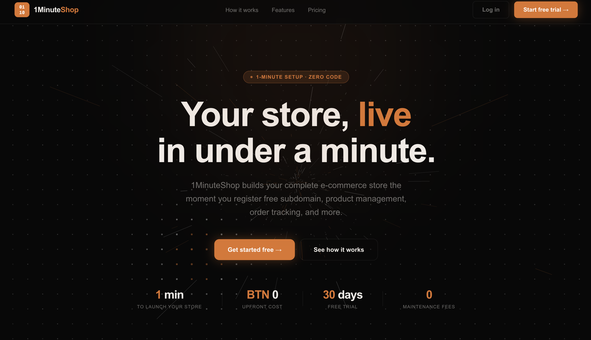
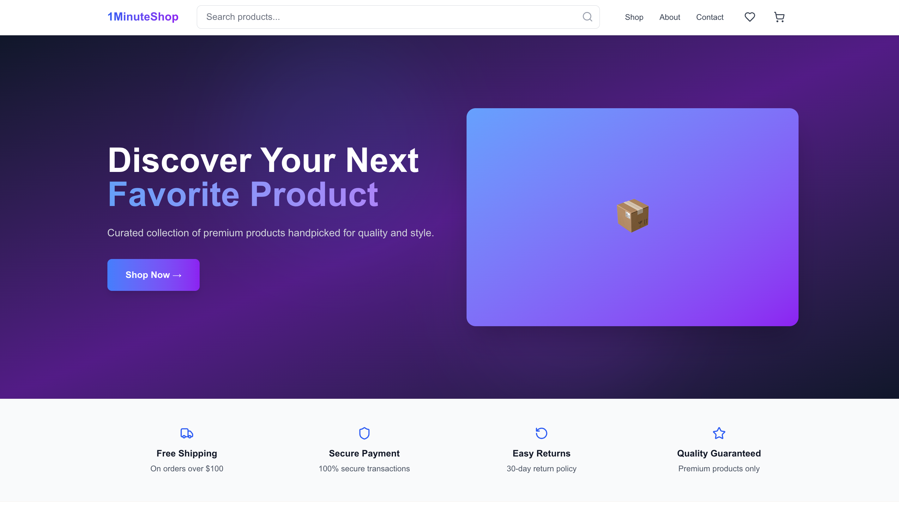
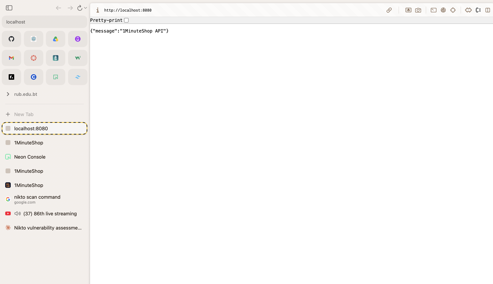
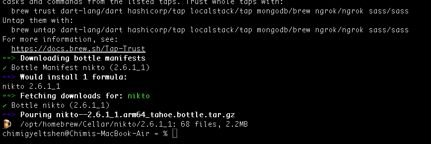
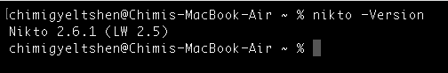
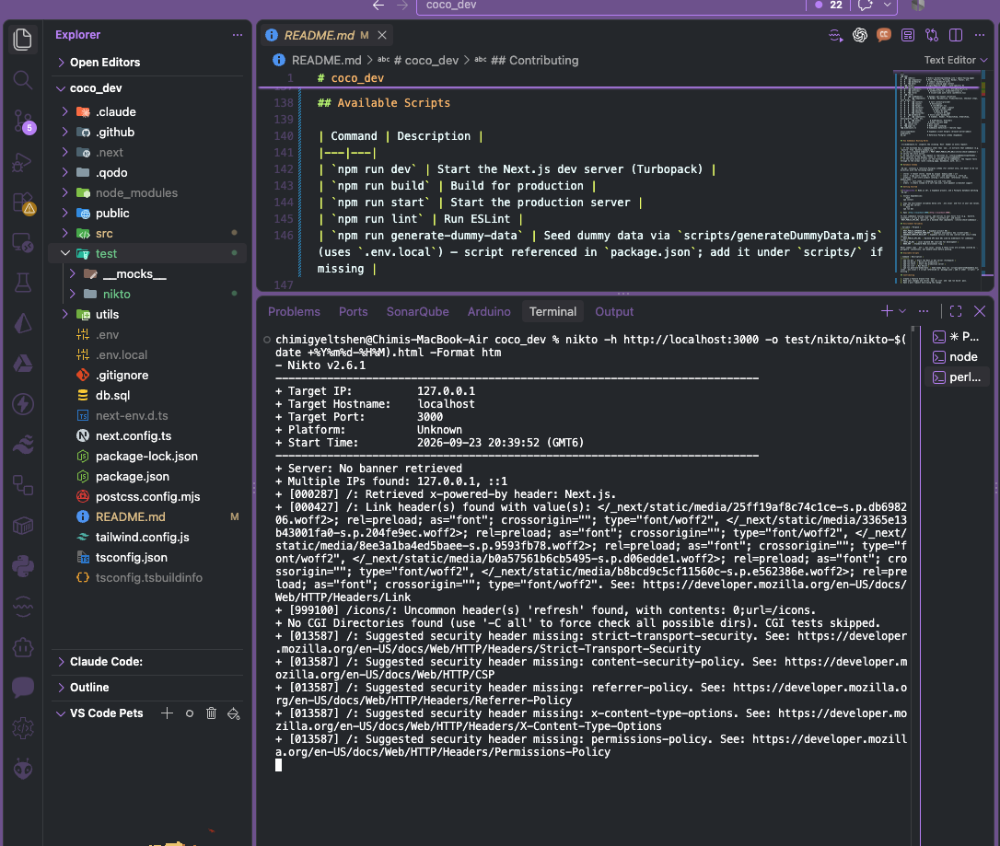
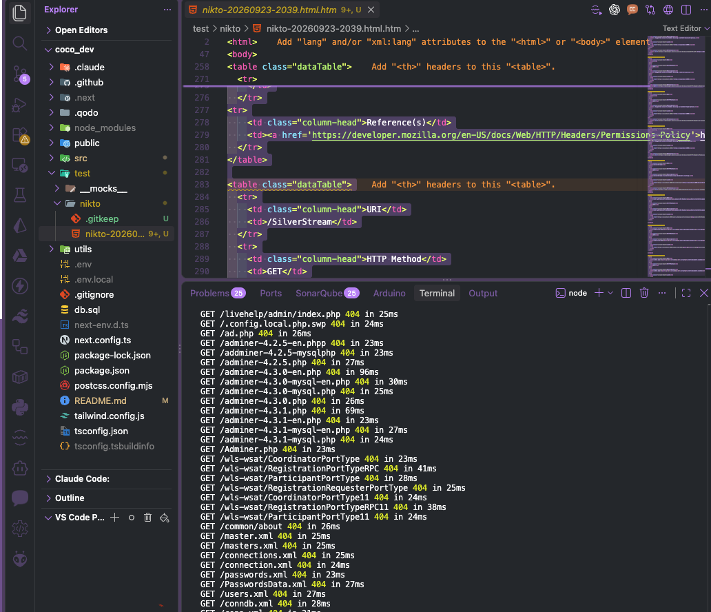
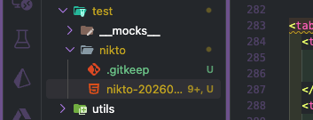
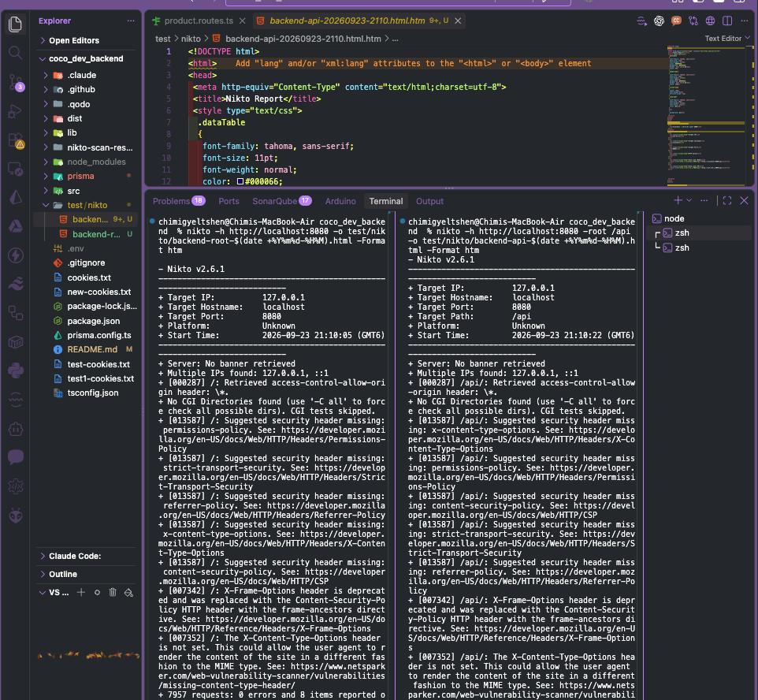
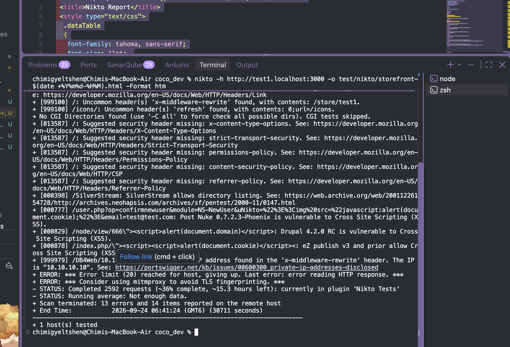

# Vulnerability Assessment of 1MinuteShop Using Nikto

A web server vulnerability assessment of **1MinuteShop**, a multi-tenant e-commerce website builder, performed with the Nikto scanner. This document covers the scope, setup, scanning process, findings, interpretation, and recommendations.

| | |
|---|---|
| **Tool** | Nikto 2.6.1 |
| **Scan dates** | 23–24 September 2026 |
| **Environment** | Local, Apple Silicon (M1) Mac, macOS |
| **Targets** | Main frontend, tenant storefront, backend API |

## Table of Contents

1. [Objective](#1-objective)
2. [Scope and Target Description](#2-scope-and-target-description)
3. [Test Environment](#3-test-environment)
4. [Installing Nikto](#4-installing-nikto)
5. [Methodology](#5-methodology)
6. [Scan 1: Main Frontend](#6-scan-1-main-frontend)
7. [Scan 2: Backend API](#7-scan-2-backend-api)
8. [Scan 3: Tenant Storefront](#8-scan-3-tenant-storefront)
9. [Consolidated Results](#9-consolidated-results)
10. [Verifying the Findings](#10-verifying-the-findings)
11. [Recommendations](#11-recommendations)
12. [Limitations](#12-limitations)
13. [Conclusion](#13-conclusion)
14. [Appendix: Scan Report Files](#14-appendix-scan-report-files)

---

## 1. Objective

The objective of this assessment is to use Nikto to identify web server misconfigurations, missing security controls, and known vulnerabilities in a sample web application, and to interpret the findings by separating real issues from informational notes and false positives.

---

## 2. Scope and Target Description

### 2.1 Overview of the Target System

The target of this assessment is **1MinuteShop**, a multi-tenant e-commerce website builder developed as a personal project. The platform allows store owners to register an account, receive a unique subdomain-based storefront (for example, `coffeecorner.laso.la`), and manage their products and orders through a dashboard. Customers browse individual storefronts and place orders as guests, uploading a payment screenshot for manual verification by the store owner.

The system is composed of two separately developed applications:

| Component | Technology | Responsibility |
|---|---|---|
| **Frontend** | Next.js 15 (App Router), React 19 | Marketing site, authentication pages, store owner dashboard, and dynamically rendered storefronts |
| **Backend** | Hono on Node.js, PostgreSQL via Prisma, JWT authentication, Supabase Storage | REST API for store owners, products, orders, customers, and file uploads |

A notable architectural feature is **subdomain-based multi-tenancy**. When a request arrives at the frontend, middleware inspects the `Host` header, extracts the subdomain, and asks the backend whether a matching store exists. If it does, the request is internally rewritten to that store's storefront route. The same frontend application therefore presents different content depending on the hostname used to access it, which is why the storefront was scanned as a separate target from the main site.

### 2.2 Targets in Scope

| Target | URL | Description |
|---|---|---|
| Main frontend | `http://localhost:3000` | Marketing landing page, login and registration pages, and store owner dashboard |
| Tenant storefront | `http://test1.localhost:3000` | Customer-facing shop for the test store `test1`, including product listing, cart, and checkout |
| Backend API | `http://localhost:8080` | REST API mounted under `/api` |

**Main frontend**



**Tenant storefront**



**Backend API**



### 2.3 Out of Scope

- **Production deployment** (`laso.la` and its subdomains): excluded to avoid generating heavy traffic against live stores.
- **Supabase-hosted services** (Storage endpoints and the managed PostgreSQL database): excluded because they are third-party infrastructure not owned by the tester.
- **Direct database testing**: Nikto is a web server scanner and interacts with the system only through HTTP.

### 2.4 Authorization

The tester is the developer and owner of the application under test. All scanning was confined to instances running on the tester's own machine. No systems belonging to other parties were scanned.

### 2.5 Rationale for Target Selection

Nikto is designed to identify web server misconfigurations, missing security headers, exposed files and directories, and outdated software. Scanning the frontend and backend separately allows these issues to be identified for each server independently, since they run on different frameworks with different default configurations. Nikto has limited ability to assess REST APIs, as it does not understand application logic such as authentication requirements or ownership checks, so the backend results are interpreted with that limitation in mind (see [Limitations](#12-limitations)).

---

## 3. Test Environment

| Item | Detail |
|---|---|
| Machine | Apple Silicon (M1) MacBook Air |
| Operating system | macOS |
| Scanner | Nikto 2.6.1, installed via Homebrew |
| Frontend | Production build (`npm run build` then `npm run start`) on port 3000 |
| Backend | Production build (`npm run build` then `npm run start`) on port 8080 |
| Storefront hostname | `test1.localhost`, mapped to `127.0.0.1` in `/etc/hosts` |
| Report location | `test/nikto/` in each project |

Both applications were run as **production builds** rather than development servers, so that the scanned configuration reflects the application's intended deployment behavior as closely as possible.

Because the application runs locally over plain HTTP, findings related to HTTPS and transport security (such as HSTS) are expected. They are recorded but interpreted in the context of a local environment, since transport security would be handled at deployment.

---

## 4. Installing Nikto

Install Nikto with Homebrew. It runs natively on Apple Silicon.

```bash
brew install nikto
```



Confirm the installation:

```bash
nikto -Version
```



---

## 5. Methodology

1. Start the backend and frontend as production builds.
2. Create a `test/nikto` folder in the project to store reports:
   ```bash
   mkdir -p test/nikto
   ```
3. Scan each target with Nikto, saving an HTML report with a timestamped filename so that repeated scans do not overwrite each other.
4. Review each finding and classify it as a **real issue**, **informational**, **false positive**, or **needs verification**.
5. Assign a severity to each real issue based on its potential impact in this application.
6. Recommend a fix for each real issue.

### Severity Guide

| Severity | Meaning |
|---|---|
| **Medium** | Should be fixed before going live |
| **Low** | Small hardening improvement |
| **Info** | Worth knowing, not a problem |
| **Positive** | Something the application does well |
| **False positive** | Nikto flagged it, but it does not apply to this application |

---

## 6. Scan 1: Main Frontend

### 6.1 Command

Run from the frontend project root:

```bash
nikto -h http://localhost:3000 -o test/nikto/nikto-$(date +%Y%m%d-%H%M).html -Format htm
```





The report was saved to the `test/nikto` directory:



### 6.2 Scan Details

| Requests | Errors | Findings | Duration |
|---|---|---|---|
| 7,964 | 1 | 16 | 481 seconds |

### 6.3 Findings

| # | Finding | What it means (in simple terms) | Severity | Verdict | How to fix |
|---|---|---|---|---|---|
| 1 | `X-Powered-By: Next.js` header | The website tells every visitor what technology it is built with. This helps attackers choose which known attacks to try. | Low | Real issue | Set `poweredByHeader: false` in `next.config.ts` |
| 2 | Missing Content-Security-Policy (CSP) | There are no rules telling the browser which scripts are allowed to run. If an attacker ever manages to inject malicious code, nothing stops the browser from running it. | Medium | Real issue | Add a CSP header in `next.config.ts` |
| 3 | No clickjacking protection (X-Frame-Options / `frame-ancestors`) | Another website could load this site inside a hidden frame and trick a logged-in store owner into clicking buttons they cannot see, such as deleting products. | Medium | Real issue | Add `Content-Security-Policy: frame-ancestors 'none'` |
| 4 | Missing X-Content-Type-Options (reported twice) | The browser may guess what type a file is instead of trusting the server. In rare cases, this lets a harmless-looking file run as a script. | Low | Real issue | Add `X-Content-Type-Options: nosniff` |
| 5 | Missing Referrer-Policy | When a user clicks a link to another site, the full URL of the page they came from may be shared with that site. | Low | Real issue | Add `Referrer-Policy: strict-origin-when-cross-origin` |
| 6 | Missing Permissions-Policy | The site does not restrict browser features like the camera, microphone, or location. If malicious code ran on the page, it could request access to them. | Low | Real issue | Add a `Permissions-Policy` header disabling unused features |
| 7 | Missing Strict-Transport-Security (HSTS) | The site does not force browsers to always use a secure HTTPS connection. This is expected here because the local test runs on plain HTTP. | Info (local) | Expected in local testing | Enable HSTS on the production HTTPS deployment |
| 8 | Link header with font preloads | Next.js tells the browser to download fonts early so the page loads faster. This is normal behavior. | Info | Not a vulnerability | No action needed |
| 9 | `/icons/` refresh header | Next.js redirects `/icons/` to `/icons` to remove the trailing slash. This is normal framework behavior. | Info | Not a vulnerability | No action needed |
| 10 | `/SilverStream` directory listing | Nikto checked for an old server product from around 2000 that could list all files in a folder. This application does not use SilverStream. | — | False positive | No action needed (see [Section 10](#10-verifying-the-findings)) |
| 11 | XSS in Post Nuke 0.7.2.3 | Nikto tested a known attack against an old content management system. This application does not use Post Nuke. | — | False positive | No action needed (see [Section 10](#10-verifying-the-findings)) |
| 12 | XSS in Drupal 4.2.0 RC | Nikto tested a known attack against a 2003 version of Drupal. This application does not use Drupal. | — | False positive | No action needed (see [Section 10](#10-verifying-the-findings)) |
| 13 | XSS in eZ publish v3 | Nikto tested a known attack against an old publishing platform. This application does not use eZ publish. | — | False positive | No action needed (see [Section 10](#10-verifying-the-findings)) |
| 14 | XSS in MyWebServer 1.0.2 | Nikto tested a known attack against an old web server (CVE-2002-1453). This application does not use MyWebServer. | — | False positive | No action needed (see [Section 10](#10-verifying-the-findings)) |
| 15 | IP address `100.100.100.200` in refresh header | Nikto sent a request containing this IP address, and the Next.js redirect simply repeated it back. The server did not reveal its own IP address. | — | False positive | No action needed |

### 6.4 Summary

| Category | Count |
|---|---|
| Real issues (Medium) | 2 |
| Real issues (Low) | 4 |
| Informational | 3 |
| False positives | 6 |

The real issues are all **missing security headers**, which are configuration problems that can be fixed in one place (`next.config.ts`). No directly exploitable vulnerabilities were found on the frontend. The six false positives came from Nikto testing for old software that is not part of this application, which shows why automated scan results need to be manually verified.

---

## 7. Scan 2: Backend API

### 7.1 Commands

Run from the backend project root. Two scans were performed: one against the server root, and one against `/api`, where all routes live. Nikto's `-root` option adds `/api` to the front of every request, so it tests paths like `/api/admin` instead of `/admin`.

```bash
nikto -h http://localhost:8080 -o test/nikto/backend-root-$(date +%Y%m%d-%H%M).html -Format htm
nikto -h http://localhost:8080 -root /api -o test/nikto/backend-api-$(date +%Y%m%d-%H%M).html -Format htm
```



### 7.2 Scan Details

| Scan | Target | Requests | Errors | Findings | Duration |
|---|---|---|---|---|---|
| Server root | `http://localhost:8080` | 7,957 | 0 | 8 | 31 seconds |
| API path | `http://localhost:8080` with `-root /api` | 7,962 | 5 | 8 | 131 seconds |

Both scans reported the same findings, so they are combined below.

### 7.3 Findings

| # | Finding | What it means (in simple terms) | Severity | Verdict | How to fix |
|---|---|---|---|---|---|
| 1 | `Access-Control-Allow-Origin: *` | The API told Nikto that any website is allowed to read its responses. The API is meant to accept requests only from the frontend and store subdomains, so the CORS rules may not be working as intended. Because login uses Bearer tokens rather than cookies, another website still cannot use a store owner's login, which limits the risk. | Low–Medium | Needs verification | Check the CORS configuration in `src/index.ts` and make sure unknown origins are rejected |
| 2 | Missing X-Content-Type-Options (reported twice per scan) | The browser may guess what type a response is instead of trusting the server. For an API, this could let a JSON response be treated as a web page or script. | Low | Real issue | Add Hono's `secureHeaders()` middleware |
| 3 | Missing Content-Security-Policy | There are no rules about which scripts may run. This matters most for web pages; the API returns JSON data, so the impact here is small. | Low | Real issue (low impact for an API) | Add Hono's `secureHeaders()` middleware |
| 4 | No clickjacking protection (`frame-ancestors`) | Another site could load API responses inside a frame. Since the API has no buttons or forms to click, there is little to exploit. | Info | Low impact for an API | Covered by `secureHeaders()` |
| 5 | Missing Referrer-Policy | Controls how much of a URL is shared when users follow links. The API does not serve pages with links, so this has little effect. | Info | Low impact for an API | Covered by `secureHeaders()` |
| 6 | Missing Permissions-Policy | Controls browser features like the camera and location. The API does not serve pages, so this has little effect. | Info | Low impact for an API | Optional |
| 7 | Missing Strict-Transport-Security (HSTS) | The server does not force secure HTTPS connections. This is expected because the local test runs on plain HTTP. | Info (local) | Expected in local testing | Enable HSTS on the production HTTPS deployment |
| 8 | No server banner retrieved | The server does not reveal what software it runs, and no `X-Powered-By` header was found. This makes it harder for attackers to target known weaknesses. | Positive | Good practice | No action needed |
| 9 | Multiple IPs found (`127.0.0.1`, `::1`) | `localhost` points to both the IPv4 and IPv6 local addresses. This is normal on macOS. | Info | Not a vulnerability | No action needed |
| 10 | 5 errors during the `/api` scan | Five of Nikto's requests failed, probably timeouts or unusual requests the server rejected. This does not indicate a vulnerability, but the backend logs can show what happened. | Info | Worth checking | Review the backend logs for errors from that time |

### 7.4 Summary

| Category | Count |
|---|---|
| Needs verification | 1 |
| Real issues (Low) | 2 |
| Informational / low impact for an API | 6 |
| Positive findings | 1 |

Nikto found no directly exploitable vulnerabilities on the backend. The most notable finding is the wildcard CORS header, which conflicts with the intended CORS configuration and should be verified. The remaining findings are missing security headers, most of which matter less for a JSON API than for a website.

---

## 8. Scan 3: Tenant Storefront

### 8.1 Preparing the Subdomain

Map the test store's subdomain to the local machine, so Nikto can resolve it:

```bash
sudo sh -c 'echo "127.0.0.1 test1.localhost" >> /etc/hosts'
```

Replace `test1` with the subdomain of any store that exists in the database.

Confirm the subdomain loads the storefront rather than the landing page:

```bash
curl -s http://test1.localhost:3000 | grep -io "<title>.*</title>"
```



### 8.2 Command

Run from the frontend project root:

```bash
nikto -h http://test1.localhost:3000 -o test/nikto/storefront-$(date +%Y%m%d-%H%M).html -Format htm
```

### 8.3 Scan Details

Three scan attempts were made:

| Scan file | Target | Requests | Errors | Findings | Duration | Result |
|---|---|---|---|---|---|---|
| `storefront-20260923-2127` | `mystore.localhost:3000` | 78 | 0 | 3 | 86 seconds | Stopped early. `mystore` was a placeholder, not a real store, so this reached the landing page instead of a storefront. **Excluded from results.** |
| `storefront-20260923-2129` | `test1.localhost:3000` | 2,885 | 0 | 14 | 2,409 seconds (40 min) | Stopped before completion |
| `storefront-20260923-2209` | `test1.localhost:3000` | 2,592 | 13 | 14 | 30,711 seconds (8.5 hours) | Terminated by Nikto after reaching its error limit |

The two `test1` scans reported the **same 14 findings**, which are combined below. Neither scan completed: the furthest reached about 2,900 of Nikto's roughly 8,000 tests (about 36%). See finding 15.

### 8.4 Findings

| # | Finding | What it means (in simple terms) | Severity | Verdict | How to fix |
|---|---|---|---|---|---|
| 1 | `X-Powered-By: Next.js` header | The storefront tells every visitor what technology it is built with. This helps attackers choose which known attacks to try. | Low | Real issue | Set `poweredByHeader: false` in `next.config.ts` |
| 2 | `x-middleware-rewrite: /store/test1` header | The response reveals the internal address the storefront is really served from. This tells attackers how the site's routing works behind the scenes. | Low | Real issue | Strip the header at the reverse proxy or hosting layer in production |
| 3 | Missing Content-Security-Policy (CSP) | There are no rules telling the browser which scripts are allowed to run. The checkout collects customers' names, phone numbers, addresses, and payment screenshots, so injected code here could steal customer data. This also means the page can be framed by other sites (clickjacking). | Medium | Real issue | Add a CSP header in `next.config.ts` |
| 4 | Missing X-Content-Type-Options | The browser may guess what type a file is instead of trusting the server. In rare cases, this lets a harmless-looking file run as a script. | Low | Real issue | Add `X-Content-Type-Options: nosniff` |
| 5 | Missing Referrer-Policy | When a customer clicks a link to another site, the full URL of the page they came from may be shared with that site. | Low | Real issue | Add `Referrer-Policy: strict-origin-when-cross-origin` |
| 6 | Missing Permissions-Policy | The site does not restrict browser features like the camera, microphone, or location. | Low | Real issue | Add a `Permissions-Policy` header disabling unused features |
| 7 | Missing Strict-Transport-Security (HSTS) | The site does not force browsers to use a secure HTTPS connection. This is expected here because the local test runs on plain HTTP. | Info (local) | Expected in local testing | Enable HSTS on the production HTTPS deployment |
| 8 | Link header with font preloads | Next.js tells the browser to download fonts early so the page loads faster. This is normal behavior. | Info | Not a vulnerability | No action needed |
| 9 | `/icons/` refresh header | Next.js redirects `/icons/` to `/icons` to remove the trailing slash. This is normal framework behavior. | Info | Not a vulnerability | No action needed |
| 10 | `/SilverStream` directory listing | Nikto checked for an old server product from around 2000. This application does not use SilverStream. | — | False positive | No action needed |
| 11 | XSS in Post Nuke 0.7.2.3 | Nikto tested a known attack against an old content management system. This application does not use Post Nuke. | — | False positive | No action needed |
| 12 | XSS in Drupal 4.2.0 RC | Nikto tested a known attack against a 2003 version of Drupal. This application does not use Drupal. | — | False positive | No action needed |
| 13 | XSS in eZ publish v3 | Nikto tested a known attack against an old publishing platform. This application does not use eZ publish. | — | False positive | No action needed |
| 14 | Private IP `10.10.10.10` in `x-middleware-rewrite` header | Nikto requested a path containing this IP address, and the middleware repeated the path back in its header. The server did not reveal a real internal IP address. | — | False positive | No action needed (fixing finding 2 also removes this) |
| 15 | Scan could not complete (observed during testing) | The storefront responded far more slowly than the main site. The main site handled about 8,000 requests in 8 minutes; the storefront managed about 2,900 in 40 minutes, and in the longest run it slowed further until it stopped responding. Every storefront request triggers a backend lookup to check the store exists, with no caching, so heavy traffic overloads it. This was observed on a local laptop, not a production server. | Medium | Performance and availability concern | Cache the subdomain check in the middleware; review backend and database logs for timeouts |

### 8.5 Summary

| Category | Count |
|---|---|
| Real issues (Medium) | 2 |
| Real issues (Low) | 5 |
| Informational | 3 |
| False positives | 5 |

The storefront shares the same missing security headers as the main site, so the same `next.config.ts` fix covers both. Two findings are specific to the storefront: the `x-middleware-rewrite` header, which reveals internal routing, and the slow response under load, which prevented the scan from completing. Because only about 36% of Nikto's tests ran, some checks that appeared in the main-site scan (such as the X-Frame-Options check) were never reached, and these results should be treated as partial.

---

## 9. Consolidated Results

### 9.1 Findings by Target

| Target | Medium | Low | Info | Positive | Needs verification | False positives |
|---|---|---|---|---|---|---|
| Main frontend | 2 | 4 | 3 | 0 | 0 | 6 |
| Backend API | 0 | 2 | 6 | 1 | 1 | 0 |
| Tenant storefront | 2 | 5 | 3 | 0 | 0 | 5 |

### 9.2 Key Observations

1. **Missing security headers are the most common issue.** They appear on all three targets. They are configuration problems, not code flaws, and each application can fix them in a single place.
2. **The missing Content-Security-Policy matters most on the frontend.** The dashboard lets store owners change products and orders, and the storefront checkout handles customer personal data, so a missing defense against injected scripts has real impact there.
3. **The storefront has a performance weakness.** Its uncached subdomain lookup caused it to slow down and stop responding under automated traffic.
4. **The backend CORS header needs verification.** Nikto received a wildcard origin that conflicts with the intended configuration.
5. **Many findings were false positives.** Eleven findings across the two frontend scans referred to old software that this application does not use, which shows why scanner output must be interpreted rather than accepted as-is.
6. **Positive result:** the backend does not reveal its server software or framework in response headers.

---

## 10. Verifying the Findings

Automated findings should be confirmed manually before being reported as final. The following checks can be run against the local environment.

**Check which security headers are present:**

```bash
curl -sI http://localhost:3000/
curl -sI http://localhost:8080/
```

**Confirm the SilverStream finding is a false positive** (a `404` status confirms it):

```bash
curl -si http://localhost:3000/SilverStream | head -1
```

**Confirm the XSS findings are false positives.** No output means the script payload is not reflected as executable code:

```bash
curl -s "http://localhost:3000/node/view/666\\\"><script>alert(document.domain)</script>" | grep -o "<script>alert"
```

Repeat for the other XSS URLs listed in the Nikto reports, or open them in a browser and confirm that no alert box appears.

**Verify the backend CORS finding.** If the response shows `*` or `https://evil.example`, unknown websites are allowed, and the finding should be changed to a real issue:

```bash
curl -si -H "Origin: https://evil.example" http://localhost:8080/api/customers | grep -i access-control
```

**Measure storefront response time:**

```bash
time curl -s -o /dev/null -w "%{http_code}\n" http://test1.localhost:3000/does-not-exist
```

---

## 11. Recommendations

Listed in order of priority.

### 11.1 Add Security Headers to the Frontend (Medium)

Fixes frontend findings 1–6 and storefront findings 1 and 3–6. Add to `next.config.ts`, merging with any existing settings:

```ts
import type { NextConfig } from "next";

const securityHeaders = [
  { key: "X-Content-Type-Options", value: "nosniff" },
  { key: "Referrer-Policy", value: "strict-origin-when-cross-origin" },
  { key: "Permissions-Policy", value: "camera=(), microphone=(), geolocation=()" },
  { key: "Content-Security-Policy", value: "frame-ancestors 'none'" },
  { key: "Strict-Transport-Security", value: "max-age=63072000; includeSubDomains" },
];

const nextConfig: NextConfig = {
  poweredByHeader: false,
  async headers() {
    return [{ source: "/:path*", headers: securityHeaders }];
  },
};

export default nextConfig;
```

The CSP above only prevents clickjacking. A full CSP that also restricts scripts requires nonces in Next.js, and the UI libraries used (MUI, Framer Motion) rely on inline styles, so a complete policy is recommended as a follow-up task using the Next.js CSP documentation.

### 11.2 Cache the Storefront Subdomain Check (Medium)

Fixes storefront finding 15. The middleware currently calls the backend on every request. Caching the result for a short time, even 60 seconds, would greatly reduce backend load. The backend and database logs from the scan period should also be reviewed for timeouts or connection pool errors.

### 11.3 Verify and Fix the Backend CORS Configuration (Low–Medium)

Fixes backend finding 1. Run the CORS check in [Section 10](#10-verifying-the-findings). If unknown origins are allowed, review the CORS setup in `src/index.ts` so that only `FRONTEND_URL`, `laso.la`, and its subdomains are accepted.

### 11.4 Add Security Headers to the Backend (Low)

Fixes backend findings 2–5 and 7. In `src/index.ts`, add Hono's built-in middleware before the routes:

```ts
import { secureHeaders } from "hono/secure-headers";

app.use("*", secureHeaders());
```

### 11.5 Hide Internal Routing Headers (Low)

Fixes storefront findings 2 and 14. Strip the `x-middleware-rewrite` header at the reverse proxy or hosting layer in production.

### 11.6 Rescan After Fixes

After applying the fixes, rebuild both applications and rerun the scans into `test/nikto`. Comparing the before and after reports confirms which findings were resolved.

---

## 12. Limitations

- **Nikto does not test application logic.** It checks web server configuration, headers, and known files. It cannot test whether API endpoints require login, or whether one store owner can access or modify another store's data. These access-control checks must be tested manually.
- **The storefront scans are partial.** Only about 36% of Nikto's tests ran before the storefront stopped responding.
- **Local environment.** Testing was performed on a laptop over plain HTTP, not on the production infrastructure. Performance results and transport-security findings may differ in production.
- **False positives.** Nikto reports findings based on pattern matching, without confirming that the affected software is installed. Every finding was reviewed, and those referring to software not used by this application were classified as false positives.
- **Point-in-time assessment.** The results reflect the application as it was on 23–24 September 2026.

---

## 13. Conclusion

Nikto was used to assess the three surfaces of 1MinuteShop: the main frontend, a tenant storefront, and the backend API. No directly exploitable vulnerabilities were identified by the scanner. The main weaknesses found were missing security headers on all targets, of which the absent Content-Security-Policy on the frontend is the most significant, and a performance weakness in the storefront that caused it to stop responding under automated traffic. A wildcard CORS header on the backend was flagged for verification.

A large share of the findings were false positives relating to old software not used by the application, which demonstrates that automated scan results must be interpreted and verified rather than accepted at face value. Nikto is effective for identifying configuration issues quickly, but it should be combined with manual testing, particularly of API access control, for a complete security assessment.

---

## 14. Appendix: Scan Report Files

| Target | Report file |
|---|---|
| Main frontend | `test/nikto/nikto-20260923-2039.html` |
| Backend (server root) | `test/nikto/backend-root-<timestamp>.html` |
| Backend (`/api`) | `test/nikto/backend-api-<timestamp>.html` |
| Tenant storefront (excluded) | `test/nikto/storefront-20260923-2127.html` |
| Tenant storefront | `test/nikto/storefront-20260923-2129.html` |
| Tenant storefront | `test/nikto/storefront-20260923-2209.html` |