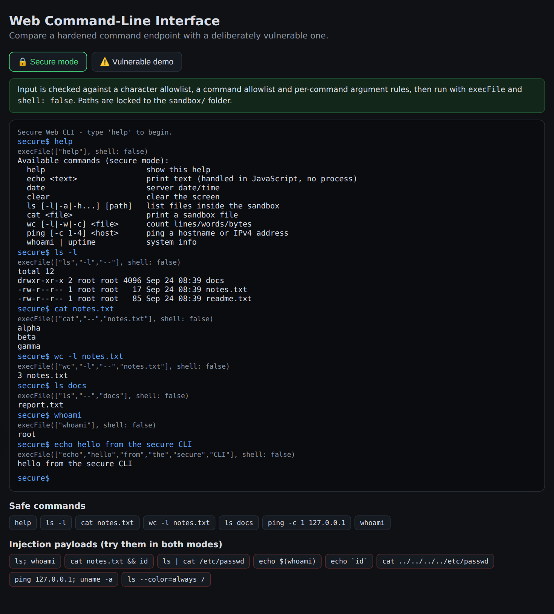
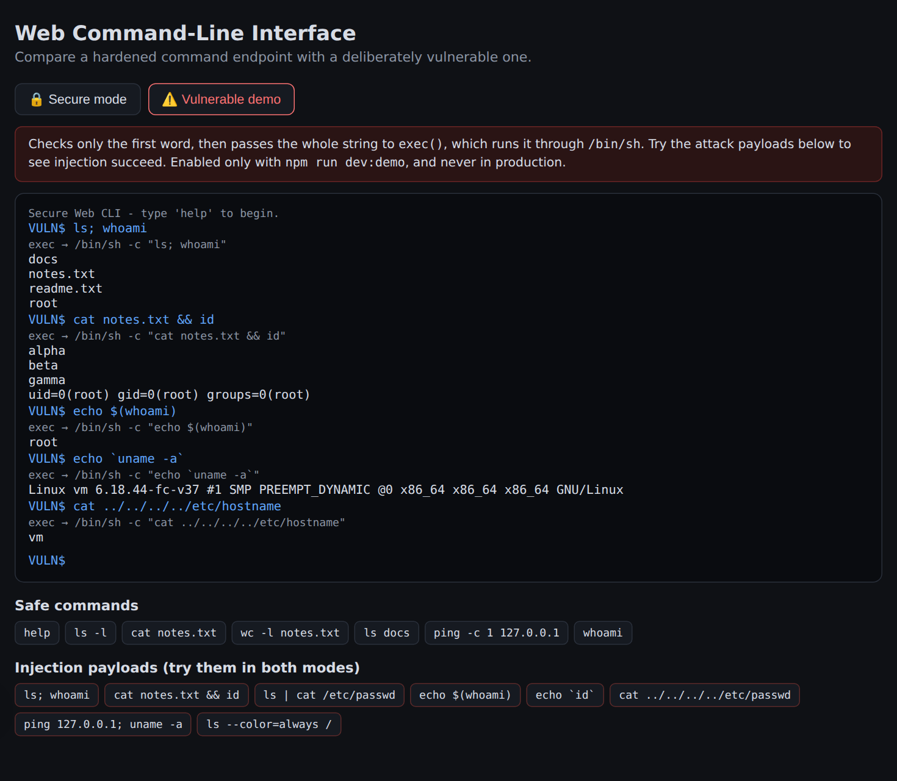
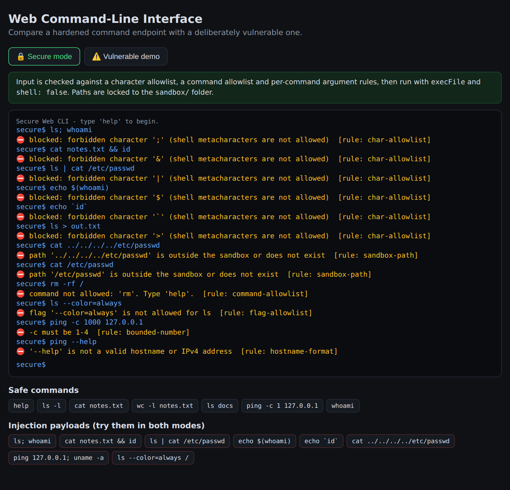
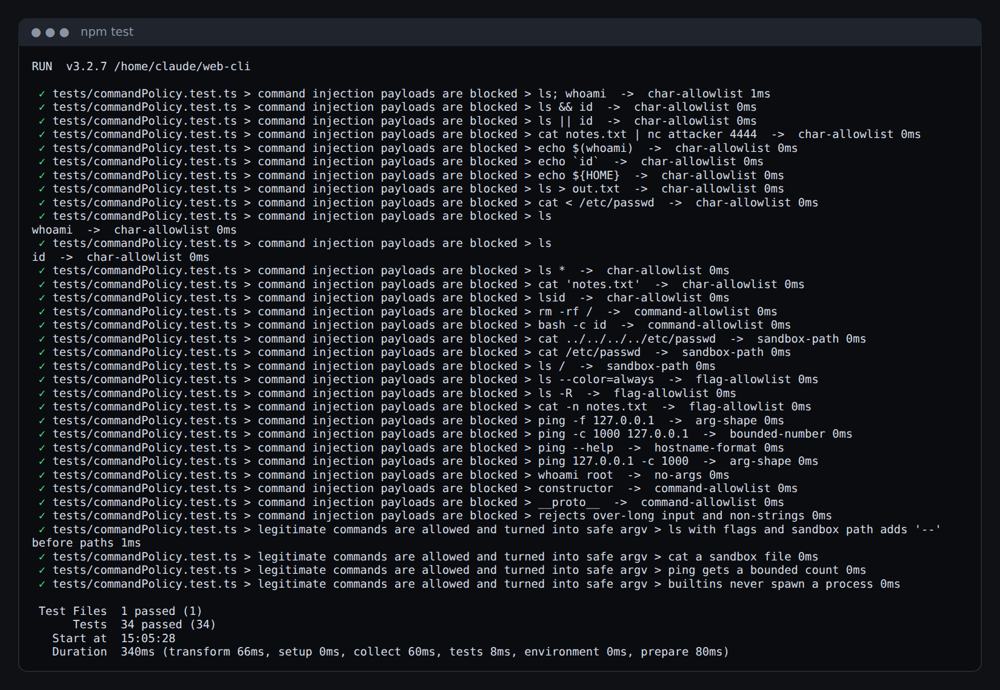
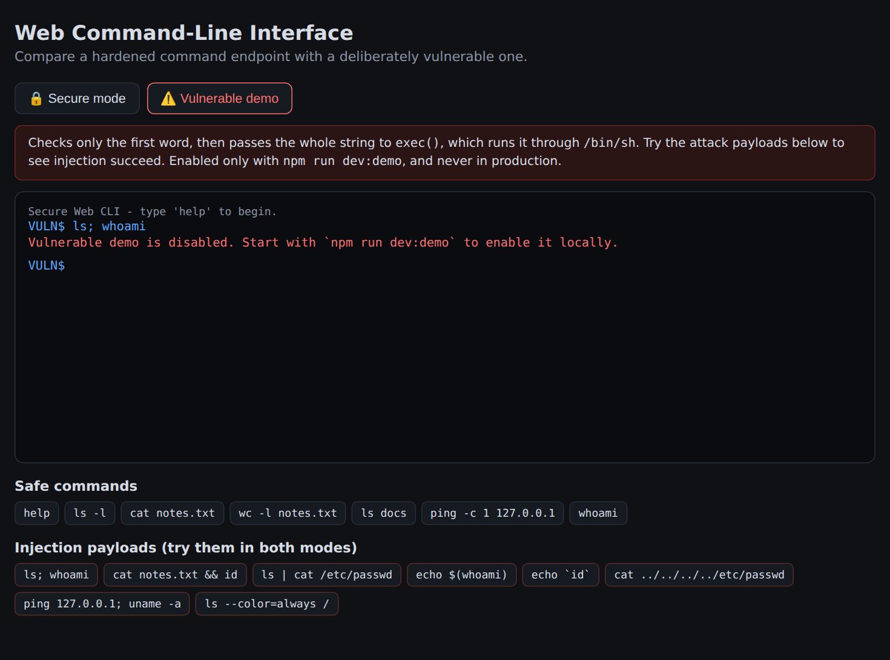
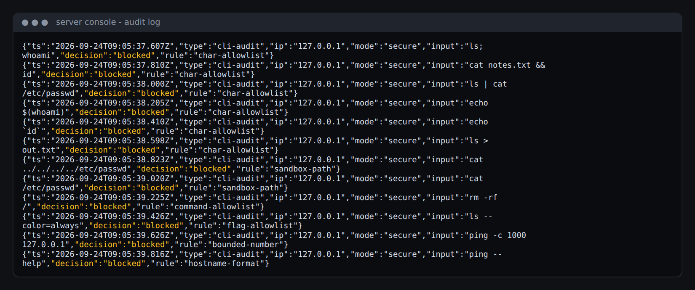

# Assignment: Web-Based Command-Line Interface with Command Injection Safeguards

## Table of Contents

1. [Introduction](#1-introduction)
2. [Objectives](#2-objectives)
3. [Background: What is Command Injection?](#3-background-what-is-command-injection)
4. [Tools and Technologies](#4-tools-and-technologies)
5. [System Design](#5-system-design)
6. [Implementation](#6-implementation)
7. [Testing](#7-testing)
8. [Results and Screenshots](#8-results-and-screenshots)
9. [Challenges I Faced](#9-challenges-i-faced)
10. [Limitations and Future Improvements](#10-limitations-and-future-improvements)
11. [Conclusion](#11-conclusion)
12. [How to Run the Project](#12-how-to-run-the-project)
13. [References](#13-references)

---

## 1. Introduction

For this assignment I built a command-line interface (CLI) that runs in a web browser. The user
types commands into a terminal on a web page. The commands are sent to the server, the server
runs them on the operating system, and the output is shown back in the browser.

A feature like this is dangerous if it is built carelessly, because the user's text ends up
being executed on the server. The main security risk is **OS command injection**, where an
attacker adds extra shell commands to their input and the server runs them too. That can give
the attacker full control of the server.

To show that I understand both the problem and the solution, I built **two versions** of the
command endpoint inside the same application:

- **A vulnerable version.** I wrote it on purpose using the common mistakes developers make, so
  I could show a real injection attack succeeding.
- **A secure version.** It uses several layers of protection, and I show it blocking every
  attack that worked against the vulnerable version.

The web page has a toggle to switch between the two modes, so the same attack can be tested
against both and the results compared side by side.

## 2. Objectives

My objectives for this assignment were to:

1. Build a working, interactive command-line interface in a web application.
2. Demonstrate how command injection works by exploiting a deliberately insecure implementation.
3. Design and implement safeguards that prevent command injection, and related attacks such as
   argument injection and path traversal.
4. Verify the safeguards with automated unit tests and manual attack testing.
5. Document the design decisions, the testing process, and the results.

## 3. Background: What is Command Injection?

Command injection (CWE-78, *Improper Neutralization of Special Elements used in an OS Command*)
happens when an application builds an operating-system command from user input and runs it
through a **shell** such as `/bin/sh`. OWASP groups it under **A03:2021 - Injection** in the
OWASP Top 10.

A shell does not simply run one program. It interprets special characters called
**metacharacters**:

| Metacharacter | Meaning to the shell | Example attack |
|---|---|---|
| `;` | run the next command afterwards | `ls; whoami` |
| `&&` / `\|\|` | run the next command if the first succeeds / fails | `cat a.txt && id` |
| `\|` | pipe output into another command | `ls \| cat /etc/passwd` |
| `$( )` and `` ` ` `` | command substitution: run a command and insert its output | `echo $(whoami)` |
| `>` / `<` | redirect output or input to a file | `ls > /var/www/shell.php` |
| newline | a new command | `ls%0Aid` |

So if a server does something like this:

```js
exec("ping -c 1 " + userInput);
```

and a user enters `8.8.8.8; rm -rf /`, the shell runs **two** commands. The server trusted the
input, and the attacker can now run anything the server's user account is allowed to run.

There are two related attacks I also had to handle:

- **Argument injection:** even without a shell, input that starts with `-` can be read by the
  program as an option (for example `--help` or `-f`), which changes what the program does.
- **Path traversal:** input like `../../../../etc/passwd` escapes the intended folder and reads
  sensitive files.

## 4. Tools and Technologies

| Tool | Why I used it |
|---|---|
| **Next.js 15 (App Router)** | Full-stack React framework. The terminal UI and the server API routes live in one project. |
| **React 19** | Builds the interactive terminal (command history, output rendering). |
| **TypeScript** | Static typing helped me catch mistakes, for example the wrong type for the process environment (see [Challenges](#9-challenges-i-faced)). |
| **Node.js `child_process`** | `exec()` for the vulnerable version and `execFile()` for the secure version. |
| **Vitest** | Unit-testing framework for the command validation logic. |
| **Playwright / Chromium** | Automated browser for capturing the screenshots in this report. |

## 5. System Design

### 5.1 Architecture

```
 ┌────────────────────────┐   POST /api/secure       ┌──────────────────────────────────────────┐
 │  Browser (React page)  │  { "command": "ls -l" }  │  Next.js API route (Node.js runtime)     │
 │                        │ ───────────────────────► │                                          │
 │  terminal UI           │                          │  1. Content-Type check (JSON only)       │
 │  mode toggle           │                          │  2. Rate limit (30 req/min per IP)       │
 │  command history       │                          │  3. parseCommand()  ← commandPolicy.ts   │
 │                        │ ◄─────────────────────── │  4. runCommand()    ← runner.ts          │
 │  output as plain text  │  { stdout, stderr, ... } │  5. audit log                            │
 └────────────────────────┘                          └───────────────┬──────────────────────────┘
                                                                     │ execFile(bin, [args], shell:false)
                                                                     ▼
                                                     ┌──────────────────────────────────────────┐
                                                     │  OS process, cwd = ./sandbox             │
                                                     │  minimal env, 6 s timeout, 64 KB cap     │
                                                     └──────────────────────────────────────────┘
```

### 5.2 Project Structure

```
web-cli/
├── app/
│   ├── page.tsx                  # Terminal UI (client component)
│   ├── layout.tsx, globals.css   # Layout and styling
│   └── api/
│       ├── secure/route.ts       # Secure command endpoint
│       └── vulnerable/route.ts   # Deliberately vulnerable endpoint (demo only)
├── lib/
│   ├── commandPolicy.ts          # Input validation: all allowlists and rules
│   ├── runner.ts                 # Safe execution with execFile(shell:false)
│   └── rateLimit.ts              # Rate limiting and audit logging
├── sandbox/                      # The only folder the CLI is allowed to read
├── tests/commandPolicy.test.ts   # 34 unit tests (attacks + valid commands)
├── docs/screenshots/             # Screenshots used in this report
└── next.config.ts                # Security headers
```

### 5.3 Design Decision: Separate Validation from Execution

I split the secure logic into two modules:

- `commandPolicy.ts` decides **whether** a command is allowed and turns it into a safe,
  structured form (`{ name, args[] }`). It never runs anything, which makes it easy to unit test.
- `runner.ts` takes that structured command and **runs** it with safe settings. It never sees
  the raw text the user typed.

Because of this split, even if I made a mistake in one layer, the other layer still protects
the system. This is the idea of **defence in depth**.

## 6. Implementation

### 6.1 The Terminal User Interface (`app/page.tsx`)

The UI looks like a real terminal. I implemented:

- A prompt (`secure$` or `VULN$`) with an input line. Pressing **Enter** sends the command to the API.
- **Command history** with the ↑ / ↓ arrow keys, and **Ctrl+L** or `clear` to clear the screen.
- A **mode toggle** between the secure and vulnerable endpoints, with a coloured banner
  explaining what each mode does.
- Clickable buttons for **safe example commands** and for **injection payloads**, so an attack
  can be tested quickly in both modes.
- In secure mode, the terminal shows the exact `execFile([...])` argument array that was run.
  In vulnerable mode, it shows the `/bin/sh -c "..."` string. This makes the difference visible.

Output is rendered as React text nodes (not with `dangerouslySetInnerHTML`), so React
escapes it automatically. Command output therefore cannot inject HTML or JavaScript into the page
(no XSS).

### 6.2 The Vulnerable Version (`app/api/vulnerable/route.ts`)

I wrote this version to copy what a developer might do without thinking about security:

```ts
const NAIVE_ALLOWED = ["help", "echo", "date", "ls", "cat", "wc", "ping", "whoami", "uptime"];

// BAD: only the first word is checked.
const first = command.trim().match(/^[a-z]+/)?.[0] ?? "";
if (!NAIVE_ALLOWED.includes(first)) { /* reject */ }

// BAD: the whole string is passed to exec(), which runs it through /bin/sh.
exec(command, { cwd: "sandbox", timeout: 6000 }, callback);
```

It looks like it has an "allowlist", but the check is useless. For `ls; whoami`, the first word
is `ls`, so it passes. `exec()` then gives the whole string to `/bin/sh`, which treats `;` as a
separator and also runs `whoami`. The same happens with `&&`, `|`, `$(...)` and backticks.
There is also no path restriction, so `cat ../../../../etc/passwd` reads system files.

**Keeping the demo safe.** Since this endpoint is dangerous, I made sure it cannot be enabled by
accident:

```ts
if (process.env.ENABLE_VULNERABLE_DEMO !== "true" || process.env.NODE_ENV === "production") {
  return NextResponse.json({ error: "Vulnerable demo is disabled..." }, { status: 403 });
}
```

It only works when I start the app with `npm run dev:demo`, and it **always** refuses in a
production build, even if the flag is set (see Screenshot 5).

### 6.3 The Secure Version: Safeguards I Implemented

I applied the safeguards in layers. An attack has to get past **all** of them, not just one.

#### Safeguard 1: Never use a shell (`lib/runner.ts`)

This is the most important fix. Instead of `exec(string)`, I use `execFile` with an
**array** of arguments and `shell: false`:

```ts
execFile(bin, cmd.args, {
  shell: false,               // no /bin/sh, so metacharacters have no special meaning
  cwd: SANDBOX_DIR,           // runs inside the sandbox folder
  timeout: 6000,              // killed after 6 seconds
  killSignal: "SIGKILL",
  maxBuffer: 64 * 1024,       // output capped at 64 KB
  env: { PATH: "/usr/bin:/bin", LANG: "C", LC_ALL: "C" },  // minimal environment
}, callback);
```

With `execFile`, each argument is passed straight to the program as a separate item in
`argv`. If a `;` somehow reached this point, `ls` would treat it as a file name called `;`,
not as a command separator. Nothing is ever interpreted by a shell.

#### Safeguard 2: Character allowlist (`lib/commandPolicy.ts`)

Before anything else, I check the whole input against a strict **allowlist** of characters:

```ts
const ALLOWED_CHARS = /^[A-Za-z0-9 ._\-/:@,=]*$/;
```

Any other character (`; & | $ \` ( ) < > * ? ' " \` newline, NUL, and so on) makes the
command get rejected. I chose an **allowlist instead of a denylist** because a denylist
depends on me remembering every dangerous character, and attackers often find one that was
forgotten. An allowlist only permits characters I know are safe. I also chose to **reject**
bad input instead of trying to "escape" or "clean" it, because escaping is easy to get wrong.

The error message names the exact character that was blocked, for example
`forbidden character ';'`, which also helps when explaining the system.

#### Safeguard 3: Command allowlist

Only specific commands are accepted:

| Type | Commands | How they run |
|---|---|---|
| Built-in | `help`, `echo`, `date`, `clear` | Implemented in JavaScript. **No process is started at all.** |
| External | `ls`, `cat`, `wc`, `ping`, `whoami`, `uptime` | Run through `execFile` after validation |

Anything else, such as `rm`, `bash`, `curl` or `nc`, is rejected. I implemented `echo` in
JavaScript on purpose: if I don't need to start a process, I don't.

I also used `Object.prototype.hasOwnProperty.call(...)` to look up commands. Otherwise an input
like `constructor` or `__proto__` could match properties of the JavaScript object prototype.

#### Safeguard 4: Per-command argument validation (prevents argument injection)

Each external command has its own validator function:

| Command | Rules |
|---|---|
| `ls` | Only flags `-l -a -h` and their combinations. Up to 3 paths, all inside the sandbox. |
| `cat` | No flags. 1-3 paths, which must be **files** inside the sandbox. |
| `wc` | Only `-l -w -c`. 1-3 sandbox files. |
| `ping` | Only `ping <host>` or `ping -c <1-4> <host>`. The host must match a strict hostname or IPv4 regex and cannot start with `-`. |
| `whoami`, `uptime` | No arguments at all. |

Flags that are not on the list, such as `ls --color=always`, `ls -R` or `ping -f` (flood ping),
are rejected. For `ping`, the count is limited to 1-4 so the command cannot be used to flood
a network.

I also insert `--` before file paths. Most Unix programs treat `--` as "end of options", so
even a file name beginning with `-` could never be read as a flag:

```ts
// user types:   ls -l docs
// executed as:  execFile("/usr/bin/ls", ["-l", "--", "docs"])
```

#### Safeguard 5: Path confinement to the sandbox (prevents path traversal)

All file paths go through `resolveSandboxPath()`:

```ts
if (userPath.startsWith("-")) return null;            // looks like an option
if (path.isAbsolute(userPath)) return null;           // e.g. /etc/passwd
if (userPath.split("/").includes("..")) return null;  // e.g. ../../etc/passwd

const resolved = path.resolve(SANDBOX_DIR, userPath);
if (!resolved.startsWith(SANDBOX_DIR + path.sep)) return null;

// Follow symbolic links and check again, so sandbox/evil -> /etc cannot escape
const real = fs.realpathSync(resolved);
if (!real.startsWith(fs.realpathSync(SANDBOX_DIR) + path.sep)) return null;
```

The last check (`realpathSync`) is important. I tested it by creating a symbolic link
`sandbox/evil` pointing to `/etc`. Without this check, `cat evil/passwd` would pass the
string checks and still read `/etc/passwd`. With the check, it is blocked.

#### Safeguard 6: Hardened execution environment

- **Absolute binary paths.** I look up each program only in trusted system folders
  (`/bin`, `/usr/bin`, `/sbin`, `/usr/sbin`) and cache the result. This prevents
  **PATH hijacking**, where a fake `ls` is placed earlier in the `PATH`.
- **Minimal environment variables.** The server's secrets (API keys and so on in `process.env`)
  are not passed to the child process.
- **Timeout and output limit.** A command that hangs is killed after 6 seconds, and output is
  capped at 64 KB, which protects against denial-of-service.

#### Safeguard 7: Request-level protections (`app/api/secure/route.ts`, `lib/rateLimit.ts`)

- **Input length limit** of 200 characters, enforced both on the server and in the input field.
- **JSON-only requests.** Requests without `Content-Type: application/json` are rejected with
  HTTP 415. This also stops simple cross-site HTML form submissions.
- **Rate limiting.** At most 30 requests per minute per IP address, otherwise HTTP 429 with a
  `Retry-After` header.
- **Type checking.** The `command` field must be a string. Objects or arrays are rejected.

#### Safeguard 8: Audit logging

Every command attempt, allowed or blocked, is written to the server console as a structured
JSON log line, with the time, IP address, input, decision, and the rule that blocked it:

```json
{"ts":"2026-09-24T09:05:37.607Z","type":"cli-audit","ip":"127.0.0.1","mode":"secure",
 "input":"ls; whoami","decision":"blocked","rule":"char-allowlist"}
```

In a real system these logs would help an administrator detect someone probing for weaknesses.

#### Safeguard 9: Security headers (`next.config.ts`)

I added `X-Content-Type-Options: nosniff`, `X-Frame-Options: DENY` (prevents clickjacking)
and `Referrer-Policy: no-referrer` to every response.

### 6.4 Summary of Safeguards

| # | Safeguard | Attack it prevents |
|---|---|---|
| 1 | `execFile` with `shell: false` | Command injection (main fix) |
| 2 | Character allowlist | Command injection, command substitution, redirection |
| 3 | Command allowlist | Running arbitrary programs (`rm`, `bash`, `nc`) |
| 4 | Flag allowlist, bounded numbers, `--` separator | Argument injection, abuse such as ping flooding |
| 5 | Sandbox path check with `realpath` | Path traversal, symlink escape |
| 6 | Absolute binaries, minimal env, timeout, output cap | PATH hijacking, secret leakage, DoS |
| 7 | Length limit, JSON-only, rate limit, type checking | Abuse, brute force, CSRF-style form posts |
| 8 | Audit logging | Helps detect attacks |
| 9 | React text rendering, security headers | XSS, clickjacking |

## 7. Testing

I tested the system in three ways.

### 7.1 Automated Unit Tests (Vitest)

I wrote **34 unit tests** in `tests/commandPolicy.test.ts`. For every attack payload, the test
checks that the command is rejected **and** that it was rejected by the rule I expected. This
proves the right layer is doing its job:

```ts
["ls; whoami",                "char-allowlist"],
["echo $(whoami)",            "char-allowlist"],
["ls\nwhoami",                "char-allowlist"],
["rm -rf /",                  "command-allowlist"],
["cat ../../../../etc/passwd","sandbox-path"],
["ls --color=always",         "flag-allowlist"],
["ping -c 1000 127.0.0.1",    "bounded-number"],
["__proto__",                 "command-allowlist"],
```

I also tested that **valid commands still work**. A security control that blocks everything is
not useful. For example, I checked that `ls -l docs` becomes exactly `["-l", "--", "docs"]`
and that `ping example.com` gets a default count of 2.

**Result: all 34 tests passed** (Screenshot 4).

### 7.2 Manual Attack Testing (Browser and curl)

I ran the same payloads against both endpoints, using the web UI and `curl`:

```bash
curl -X POST http://localhost:3000/api/secure \
     -H "Content-Type: application/json" \
     -d '{"command":"ls; whoami"}'
```

| # | Payload | Attack type | Vulnerable endpoint | Secure endpoint |
|---|---|---|---|---|
| 1 | `ls; whoami` | Command chaining | **Exploited**: listed files, then printed `root` | Blocked (`char-allowlist`) |
| 2 | `cat notes.txt && id` | Conditional chaining | **Exploited**: printed `uid=0(root)…` | Blocked (`char-allowlist`) |
| 3 | `ls \| cat /etc/passwd` | Pipe | **Exploited** | Blocked (`char-allowlist`) |
| 4 | `echo $(whoami)` | Command substitution | **Exploited**: printed `root` | Blocked (`char-allowlist`) |
| 5 | `` echo `uname -a` `` | Backtick substitution | **Exploited**: printed kernel info | Blocked (`char-allowlist`) |
| 6 | `ls > out.txt` | Redirection | **Exploited**: file written | Blocked (`char-allowlist`) |
| 7 | `cat ../../../../etc/passwd` | Path traversal | **Exploited**: leaked `/etc/passwd` | Blocked (`sandbox-path`) |
| 8 | `cat /etc/passwd` | Absolute path | **Exploited** | Blocked (`sandbox-path`) |
| 9 | `cat evil/passwd` (symlink to `/etc`) | Symlink escape | – | Blocked (`sandbox-path`) |
| 10 | `rm -rf /` | Dangerous command | Rejected by the naive check | Blocked (`command-allowlist`) |
| 11 | `ls --color=always` | Argument injection | – | Blocked (`flag-allowlist`) |
| 12 | `ping -c 1000 127.0.0.1` | Resource abuse | – | Blocked (`bounded-number`) |
| 13 | `ping --help` | Option as hostname | – | Blocked (`hostname-format`) |
| 14 | Form post (not JSON) | CSRF-style request | – | Rejected (HTTP 415) |
| 15 | Vulnerable endpoint on a production build | Misconfiguration | Disabled (HTTP 403) | – |

Every attack that worked against the vulnerable endpoint was blocked by the secure endpoint.

### 7.3 Functional Testing

I also confirmed that normal commands (`help`, `ls -l`, `cat notes.txt`, `wc -l notes.txt`,
`ls docs`, `whoami`, `echo`, `date`) work correctly in secure mode (Screenshot 1), and that the
production build compiles without errors using `npm run build`.

## 8. Results and Screenshots

### Screenshot 1: Secure mode running normal commands

The secure CLI works normally for allowed commands. Under each command, the grey line shows the
exact `execFile([...], shell: false)` call that was made. Notice the `--` separator that was
added automatically before file paths.



### Screenshot 2: Vulnerable mode, where injection succeeds

This shows the vulnerable endpoint being exploited. Each grey line shows the command string
going to `/bin/sh -c`. `ls; whoami` ran both commands, `cat notes.txt && id` revealed the
server runs as `root`, and command substitution with `$( )` and backticks executed hidden
commands. `cat ../../../../etc/hostname` read a file outside the application folder.



### Screenshot 3: Secure mode, where every attack is blocked

The same attacks (and more) sent to the secure endpoint. Every one is blocked, and the message
shows which safeguard stopped it: `char-allowlist`, `sandbox-path`, `command-allowlist`,
`flag-allowlist`, `bounded-number` or `hostname-format`.



### Screenshot 4: Unit tests passing

All 34 automated tests pass. Each attack test also checks *which* rule blocked the payload.



### Screenshot 5: Vulnerable endpoint disabled in production

When the app runs as a production build, the vulnerable endpoint refuses to execute anything,
even though `ENABLE_VULNERABLE_DEMO=true` was set. This proves the demo code cannot be exposed
by accident.



### Screenshot 6: Server audit log

The server's audit log records each blocked attempt with a timestamp, IP address, the input,
and the rule that blocked it.



## 9. Challenges I Faced

1. **My naive check at first did not "work" for the demo.** In my first vulnerable version I
   took the first word with `command.split(" ")[0]`. For `ls; whoami` this gave `ls;` (with the
   semicolon), which was not in the list, so the attack was accidentally rejected. I changed it
   to take only the leading letters (`/^[a-z]+/`), which is how real vulnerable code often
   behaves. This taught me that the security of a check depends on small parsing details, and
   that "it happened to block my test" is not the same as "it is secure".

2. **Understanding that `shell: false` alone is not enough.** At first I thought switching to
   `execFile` fixed everything. Then I realised that without a shell an attacker can still pass
   **options** (argument injection), for example `ls -R /` to list the whole disk. That is why I
   added the flag allowlists and the `--` separator.

3. **Symbolic link escape.** My first path check only used `path.resolve` and `startsWith`. When
   I created a symlink inside the sandbox pointing to `/etc`, the check passed, because the
   *string* was inside the sandbox even though the *real file* was not. I fixed it by also
   checking `fs.realpathSync()`.

4. **A TypeScript build error.** The production build failed because the `env` option of
   `execFile` expects the full `ProcessEnv` type. My minimal environment object did not include
   `NODE_ENV`. I fixed it with an explicit type assertion. This is an example of TypeScript
   catching a problem at build time.

5. **JavaScript prototype properties.** While writing tests I realised that looking up
   `VALIDATORS[name]` for a name like `constructor` could return a built-in object property.
   I used `Object.prototype.hasOwnProperty.call()` so only commands I defined are matched.

## 10. Limitations and Future Improvements

- **The rate limiter is in memory.** It resets when the server restarts and does not work across
  several servers. In production I would use a shared store such as Redis.
- **There is no authentication.** In a real system, only logged-in and authorised users (for
  example administrators) should be able to use a CLI like this.
- **The process runs as the same user as the server.** In my test environment that was `root`,
  which made the vulnerable demo more dangerous. In production I would run the app as an
  **unprivileged user** inside a container (Docker) with a read-only file system, dropped
  capabilities, and no network access where possible.
- **Replace commands with library calls where possible.** For example, `ls` and `cat` could be
  replaced with Node's `fs.readdir` and `fs.readFile`. That avoids starting OS processes at all,
  which is OWASP's first recommendation.
- **The allowlist is strict.** For example, file names containing spaces or quotes cannot be
  used. I accepted this trade-off because security was more important than flexibility here.
- **CSRF tokens and a Content Security Policy** could be added as further layers.

## 11. Conclusion

In this assignment I built a working web-based command-line interface and showed, with a real
exploit, how dangerous command injection is. The vulnerable version let me run any command,
find out the server ran as `root`, and read system files, with only one line of bad code
(`exec(userInput)`).

The most important lesson I learned is that **user input must never be interpreted by a
shell**. Using `execFile` with an argument array and `shell: false` removes the root cause. I
also learned that a single defence is not enough. Argument injection, path traversal, symlink
escapes and resource abuse each needed their own safeguard. By combining allowlists (not
denylists), strict per-command validation, sandboxing, a hardened execution environment, rate
limiting and logging, the secure version blocked every attack I tested, while still letting
normal commands work. The 34 unit tests give me confidence the safeguards keep working if the
code is changed later.

## 12. How to Run the Project

**Requirements:** Node.js 18 or newer, and macOS or Linux.

```bash
# 1. Install dependencies
npm install

# 2a. Run in secure mode only
npm run dev
#     -> open http://localhost:3000

# 2b. OR run with the vulnerable demo enabled (for comparison, local use only)
npm run dev:demo

# 3. Run the unit tests
npm test

# 4. Production build (the vulnerable endpoint is always disabled here)
npm run build && npm start
```

> ⚠️ **Warning:** `npm run dev:demo` enables an endpoint that allows arbitrary command
> execution. I only ran it on my own machine and never exposed it to a network.

## 13. References

1. OWASP Foundation. *Command Injection*. https://owasp.org/www-community/attacks/Command_Injection
2. OWASP Cheat Sheet Series. *OS Command Injection Defense Cheat Sheet*. https://cheatsheetseries.owasp.org/cheatsheets/OS_Command_Injection_Defense_Cheat_Sheet.html
3. OWASP Top 10 (2021). *A03:2021 – Injection*. https://owasp.org/Top10/A03_2021-Injection/
4. MITRE. *CWE-78: Improper Neutralization of Special Elements used in an OS Command*. https://cwe.mitre.org/data/definitions/78.html
5. MITRE. *CWE-88: Improper Neutralization of Argument Delimiters in a Command (Argument Injection)*. https://cwe.mitre.org/data/definitions/88.html
6. Node.js Documentation. *Child process: `child_process.execFile()`*. https://nodejs.org/api/child_process.html
7. Next.js Documentation. *Route Handlers*. https://nextjs.org/docs/app/building-your-application/routing/route-handlers
